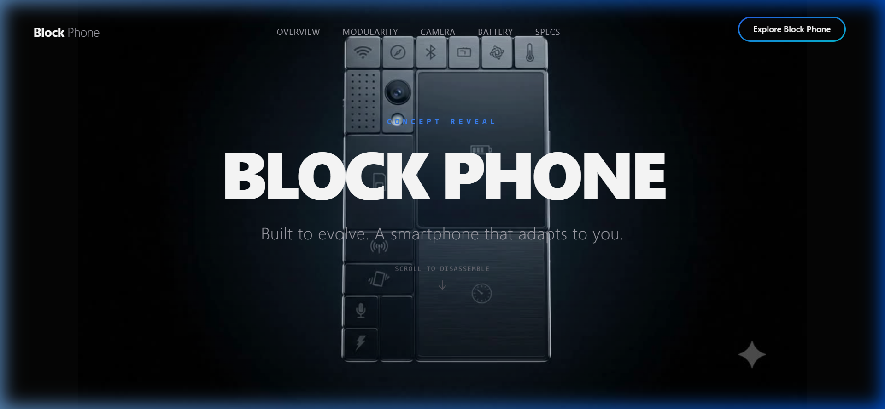
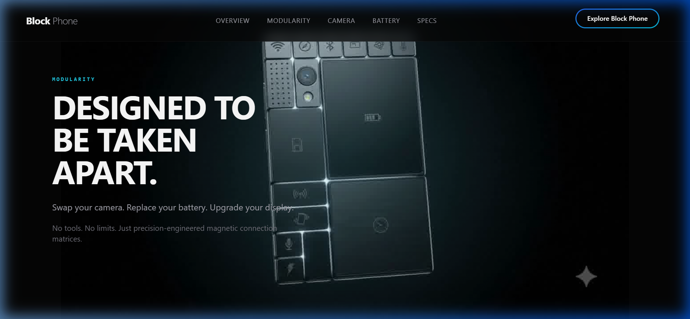
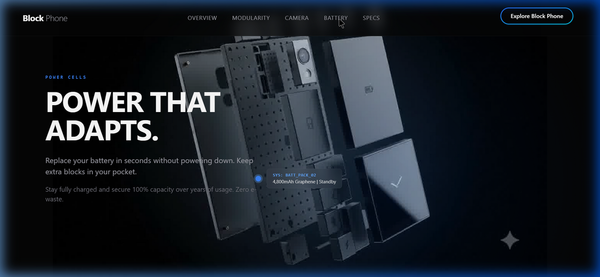

# 📱 Block Phone — Built to Evolve

An ultra-premium, interactive scrollytelling landing page showcasing a futuristic modular smartphone concept called **Block Phone**. As the user scrolls, a high-resolution 240-frame image sequence disassembles the phone into individual hardware blocks (display, camera, battery, SOC) and reassembles them smoothly, accompanied by dynamic text overlays and technical HUD callouts.

---

## 🎨 Visual Showcase

### 1. Assembled Hero View
The smartphone is presented fully assembled in a deep black infinite space, dynamically lit by soft radial gradients.


### 2. Disassembled Engineering View
Scrolling down initiates a smooth modular disassembly sequence, triggering custom typography and technical specs.


### 3. Hot-Swappable Graphene Battery View
Hovering and scrolling triggers interactive HUD anchors highlighting the hot-swappable dual-cell graphene battery and pro optics blocks.


---

## ⚡ Core Technical Architectures & Features

*   **High-Performance HTML5 Canvas Engine:** Utilizes raw Canvas drawing over WebGL or heavy video tags to deliver 240-frame sequence rendering, achieving smooth playback with zero rendering stutters.
*   **Progressive Preloader Queue (3x Load Speed):** Splitting initial loading into two phases:
    1.  **Phase 1 (Keyframes):** Preloads only every 3rd frame (80 keyframes total). The loader screen fades out immediately when Phase 1 finishes.
    2.  **Phase 2 (Background Thread):** Caches the remaining 160 intermediate frames sequentially in a queue with a `15ms` delay, preventing event-loop congestion.
    3.  **Outward Fallback Matching:** If a user scrolls past a frame that has not finished loading, the engine draws the closest cached neighbor to prevent visual flickering.
*   **Deceleration momentum Interpolation (Lerping):** The scroll position is mapped to the frame index via a linear interpolation curve (`targetFrame = targetFrame + (scrollFrame - targetFrame) * 0.07`), damping raw scroll ticks into fluid, organic animation loops.
*   **Dynamic Background Color Sampling:** At runtime, the engine draws the corners of the first frame on a hidden off-screen canvas, averages the RGB values, and updates a CSS custom property (`--bg-sampled`) on the document root to guarantee 100% seamless color blending.
*   **Virtual Page Navigation:** Navbar links utilize absolute window-scroll calculations, scrolling the viewport dynamically to the exact progress offsets within the `500vh` scroll track that trigger each virtual module focus state.

---

## 🛠️ Technology Stack

*   **Framework:** [Next.js 14](https://nextjs.org) (App Router mental model)
*   **Styling:** [Tailwind CSS](https://tailwindcss.com) (Utility-first styling with custom glassmorphism)
*   **Animation:** [Framer Motion](https://www.framer.com/motion/) (Responsive text entry and exit transitions)
*   **Icons:** [Lucide React](https://lucide.dev) (Premium vector icons)

---

## 🚀 Getting Started

### Prerequisites
*   Node.js (v18.0.0 or higher)
*   npm (v10.0.0 or higher)

### Installation
1.  Clone the repository and navigate to the project directory:
    ```bash
    git clone https://github.com/your-username/block-phone.git
    cd block-phone
    ```
2.  Install dependencies:
    ```bash
    npm install
    ```
3.  Launch the local development server:
    ```bash
    npm run dev
    ```
4.  Open [http://localhost:3000](http://localhost:3000) in your browser.

### Building for Production
To build the static application bundle:
```bash
npm run build
npm run start
```

---

## 🌐 Deployment on Vercel

The easiest way to deploy this Next.js app is via [Vercel](https://vercel.com/new):

1.  Push your project to GitHub, GitLab, or Bitbucket.
2.  Import the repository into Vercel.
3.  Vercel will detect Next.js settings automatically. Click **Deploy**.
4.  Alternatively, deploy instantly using the Vercel CLI:
    ```bash
    npx vercel
    ```

